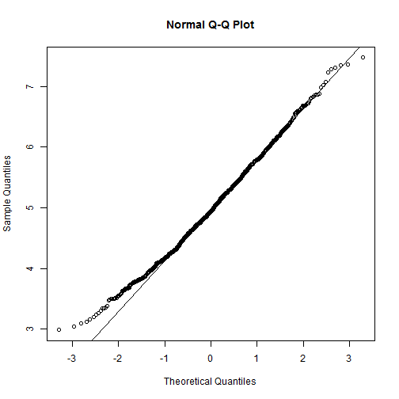
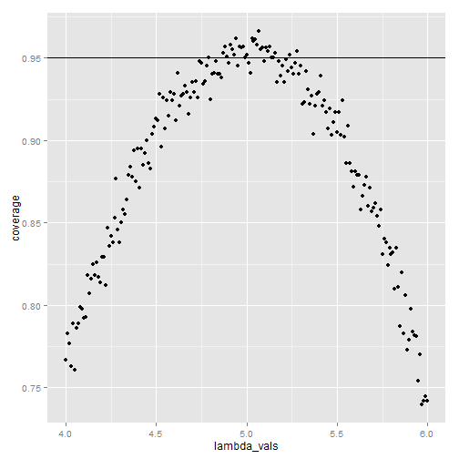

###Simulations

The exponential distribution can be simulated in R with rexp(n, lambda) where lambda() is the rate parameter. The mean of exponential distribution is 1/?? and the standard deviation is also 1/??. For this simulation, we set ??=0.2. In this simulation, we investigate the distribution of averages of 40 exponential(0.2)s.

Lets start by doing a thousand simulated averages of 40 exponentials.


```r
# Set seed
set.seed(3)
lambda <- 0.2
# We perform 1000 simulations with 40 samples 
sample_size <- 40
simulations <- 1000

# Lets do 1000 simulations
simulated_exponentials <- matrix(rexp(simulations*sample_size, rate=lambda), simulations, sample_size)
# Averages of 40 exponentials
row_means <- rowMeans(simulated_exponentials)
```

Results

##1. Show where the distribution is centered at and compare it to the theoretical center of the distribution.

#### mean of distribution of averages of 40 exponentials
mean(row_means) = 4.9866197

#### mean from analytical expression
5


The distribution of sample means is shown below:


```r
# plot the histogram of averages
hist(row_means, breaks=50, prob=TRUE,
     main="Distribution of averages of samples,
     drawn from exponential distribution with lambda=0.2",
     xlab="")
# density of the averages of samples
lines(density(row_means))
# theoretical center of distribution
abline(v=1/lambda, col="red")
# theoretical density of the averages of samples
xfit <- seq(min(row_means), max(row_means), length=100)
yfit <- dnorm(xfit, mean=1/lambda, sd=(1/lambda/sqrt(sample_size)))
lines(xfit, yfit, pch=22, col="red", lty=2)
# add legend
legend('topright', c("simulation", "theoretical"), lty=c(1,2), col=c("black", "red"))
```

 

Therefore, the distribution of averages of 40 exponentials is centered at 4.9866 and the same is close to the theoretical center of the distribution, which is ?????1 = 5.


##2. Show how variable it is and compare it to the theoretical variance of the distribution.

# standard deviation of distribution of averages of 40 exponentials

```r
sd(row_means)
```

```
## [1] 0.7910484
```

Standard deviation

```r
# standard deviation from analytical expression
(1/lambda)/sqrt(sample_size)
```

```
## [1] 0.7905694
```

Variance of the sample

```r
# Variance of the sample mean
var(row_means)
```

```
## [1] 0.6257575
```


Theoritical variance of distribution

```r
# Theoritcal variance of the distribution
1/((0.2*0.2) * 40)
```

```
## [1] 0.625
```

Therefore, the variability in distribution of averages of 40 exponentials is close to the theoretical variance of the distribution.
The variance of sample means is 0.6258 where as the theoretical variance of the distribution is ??2/n=1/(??2n)=1/(0.04×40) = 0.625.


##3. Show that the distribution is approximately normal.

due to the central limit the central imit theorem


```r
qqnorm(row_means); qqline(row_means)
```

 

Due to the central limit theorem, the averages of samples follow normal distribution. The figure above also shows the density computed using the histogram and the normal density plotted with theoretical mean and variance values. Also, the q-q plot suggests the distribution of averages of 40 exponentials is very close to a normal distribution.


```r
lambda_vals <- seq(4, 6, by=0.01)
coverage <- sapply(lambda_vals, function(lamb) {
    mu_hats <- rowMeans(matrix(rexp(sample_size*simulations, rate=0.2),
                               simulations, sample_size))
    ll <- mu_hats - qnorm(0.975) * sqrt(1/lambda**2/sample_size)
    ul <- mu_hats + qnorm(0.975) * sqrt(1/lambda**2/sample_size)
    mean(ll < lamb & ul > lamb)
})

library(ggplot2)
qplot(lambda_vals, coverage) + geom_hline(yintercept=0.95)
```

 

The 95% confidence intervals for the rate parameter (??) to be estimated (??^) are ??^low=??^(1???1.96n???) and ??^upp=??^(1+1.96n???). As can be seen from the plot above, for selection of ??^ around 5, the average of the sample mean falls within the confidence interval at least 95% of the time. Note that the true rate, ?? is 5.

Since, we consider the distribution of averages of exponentials, the standard deviation of this distribution already incorporates the n????????? term i.e. it is the standard error.

The confidence interval is given by 3.4362, 6.5371
