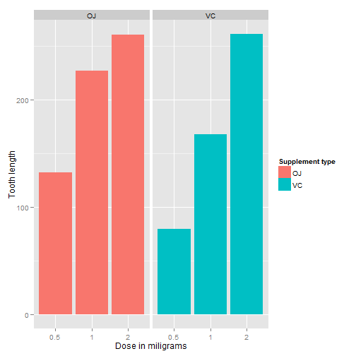

1. Load the ToothGrowth data and perform some basic exploratory data analysis


```r
# load the dataset
library(datasets)
data(ToothGrowth)

# look at the dataset variables
head(ToothGrowth)
```

```
##    len supp dose
## 1  4.2   VC  0.5
## 2 11.5   VC  0.5
## 3  7.3   VC  0.5
## 4  5.8   VC  0.5
## 5  6.4   VC  0.5
## 6 10.0   VC  0.5
```

```r
str(ToothGrowth)
```

```
## 'data.frame':	60 obs. of  3 variables:
##  $ len : num  4.2 11.5 7.3 5.8 6.4 10 11.2 11.2 5.2 7 ...
##  $ supp: Factor w/ 2 levels "OJ","VC": 2 2 2 2 2 2 2 2 2 2 ...
##  $ dose: num  0.5 0.5 0.5 0.5 0.5 0.5 0.5 0.5 0.5 0.5 ...
```

```r
# convert variable dose from numeric to factor
ToothGrowth$dose <- as.factor(ToothGrowth$dose)

# review dataset variables after conversion
str(ToothGrowth)
```

```
## 'data.frame':	60 obs. of  3 variables:
##  $ len : num  4.2 11.5 7.3 5.8 6.4 10 11.2 11.2 5.2 7 ...
##  $ supp: Factor w/ 2 levels "OJ","VC": 2 2 2 2 2 2 2 2 2 2 ...
##  $ dose: Factor w/ 3 levels "0.5","1","2": 1 1 1 1 1 1 1 1 1 1 ...
```

```r
# number of rows of dataset
nrow(ToothGrowth)
```

```
## [1] 60
```


2. Provide a basic summary of the data.

```r
# summary statistics for all variables
summary(ToothGrowth)
```

```
##       len        supp     dose   
##  Min.   : 4.20   OJ:30   0.5:20  
##  1st Qu.:13.07   VC:30   1  :20  
##  Median :19.25           2  :20  
##  Mean   :18.81                   
##  3rd Qu.:25.27                   
##  Max.   :33.90
```

```r
# split of cases between different dose levels and delivery methods
table(ToothGrowth$dose, ToothGrowth$supp)
```

```
##      
##       OJ VC
##   0.5 10 10
##   1   10 10
##   2   10 10
```

```r
library(ggplot2)
ggplot(data=ToothGrowth, aes(x=as.factor(dose), y=len, fill=supp)) +
    geom_bar(stat="identity",) +
    facet_grid(. ~ supp) +
    xlab("Dose in miligrams") +
    ylab("Tooth length") +
    guides(fill=guide_legend(title="Supplement type"))
```

 

As can be seen above, there is a clear positive correlation between the tooth length and the dose levels of Vitamin C, for both delivery methods.

3. Use confidence intervals and hypothesis tests to compare tooth growth by supp and dose.

95% confidence intervals for two variables and the intercept are as follows:


```r
fit <- lm(len ~ dose + supp, data=ToothGrowth)
confint(fit)
```

```
##                 2.5 %    97.5 %
## (Intercept) 10.475238 14.434762
## dose1        6.705297 11.554703
## dose2       13.070297 17.919703
## suppVC      -5.679762 -1.720238
```

The confidence intervals mean that if we collect a different set of data and estimate parameters of the linear model many times, 95% of the time, the coefficient estimations will be in these ranges. For each coefficient (i.e. intercept, dose and suppVC), the null hypothesis is that the coefficients are zero, meaning that no tooth length variation is explained by that variable. All p-values are less than 0.05, rejecting the null hypothesis and suggesting that each variable explains a significant portion of variability in tooth length, assuming the significance level is 5%.

The effect of the dose can also be identified using regression analysis. One interesting question that can also be addressed is whether the supplement type (i.e. orange juice or ascorbic acid) has any effect on the tooth length.


```r
summary(fit)
```

```
## 
## Call:
## lm(formula = len ~ dose + supp, data = ToothGrowth)
## 
## Residuals:
##    Min     1Q Median     3Q    Max 
## -7.085 -2.751 -0.800  2.446  9.650 
## 
## Coefficients:
##             Estimate Std. Error t value Pr(>|t|)    
## (Intercept)  12.4550     0.9883  12.603  < 2e-16 ***
## dose1         9.1300     1.2104   7.543 4.38e-10 ***
## dose2        15.4950     1.2104  12.802  < 2e-16 ***
## suppVC       -3.7000     0.9883  -3.744 0.000429 ***
## ---
## Signif. codes:  0 '***' 0.001 '**' 0.01 '*' 0.05 '.' 0.1 ' ' 1
## 
## Residual standard error: 3.828 on 56 degrees of freedom
## Multiple R-squared:  0.7623,	Adjusted R-squared:  0.7496 
## F-statistic: 59.88 on 3 and 56 DF,  p-value: < 2.2e-16
```


The model explains 70% of the variance in the data. The intercept is 12.455, meaning that with no supplement of Vitamin C, the average tooth length is 12.455 units. The coefficient of `dose` is 9.13. It can be interpreted as increasing the delievered dose 1 mg, all else equal (i.e. no change in the supplement type), would increase the tooth length 9.13 units. The last coefficient is for the supplement type. Since the supplement type is a categorical variable, dummy variables are used. The computed coefficient is for `suppVC` and the value is 15.495 meaning that delivering a given dose as ascorbic acid, without changing the dose, would result in 15.495 units of decrease in the tooth length. Since there are only two categories, we can also conclude that on average, delivering the dosage as orange juice would increase the tooth length by 15.495 units.

